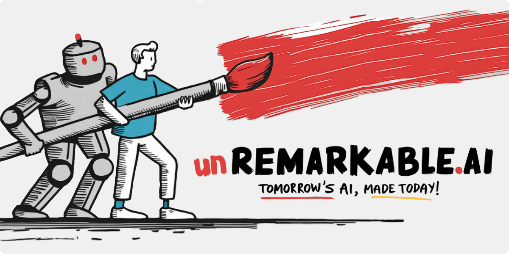

# ✏️ unREMARKABLE.ai

# 🚂 Rails on Lambda

Simple Rails & AWS Lambda Integration using Rack. Event-driven and deeply integrated within AWS, Lambda allows your Rails architecture to be completely re-imagined atop fully managed infrastructure resources like Aurora, SQS, S3, CloudWatch, IAM, and much more. Using Lamby can help your engineering teams learn to "program the cloud".

# 🔗 Linkedin

* https://www.linkedin.com/in/metaskills/

# 💬 Socials

* 🦋 Bluesky - https://bsky.app/profile/unremarkable.ai
* ❌ Twitter - https://twitter.com/metaskills

# 📚 Writing

* https://unremarkable.ai
* https://dev.to/metaskills

# 🎬 Speaking

* https://speakerdeck.com/metaskills
